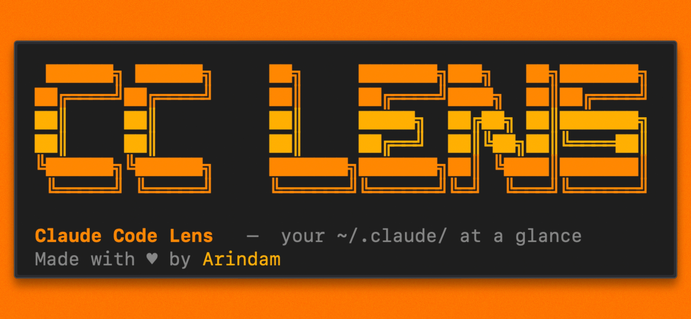

# Claude Code Lens (cc-lens)

Local analytics dashboard for Claude Code. No cloud, no telemetry, no API key, just your `~/.claude/` data, visualized.

```bash
npx cc-lens
```

The CLI finds a free local port, starts the dashboard, and opens it in your browser.

## Quick Start

Run directly with `npx`:

```bash
npx cc-lens
```

On first run, `cc-lens` prepares a small runtime cache in `~/.cc-lens/`. After that, launches are faster.

## What You Can See

### Overview

<picture>
  <source media="(prefers-color-scheme: dark)" srcset="./public/dashboard-dark.png" />
  <source media="(prefers-color-scheme: light)" srcset="./public/dashboard-white.png" />
  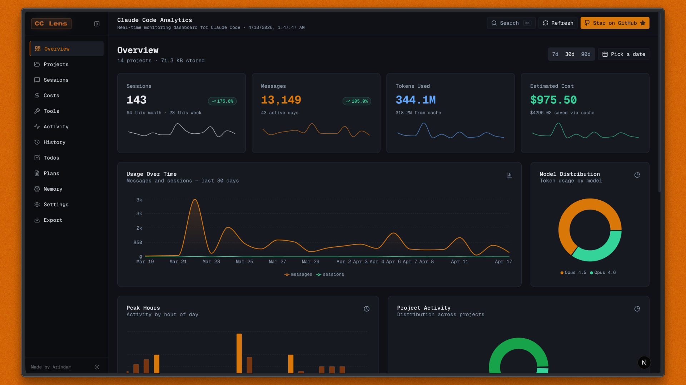
</picture>

- Sessions, messages, token usage, estimated cost, and local storage.
- Trend cards with sparklines.
- Date presets for 7, 30, and 90 days, plus a custom date range picker.
- Usage over time, model distribution, peak hours, project activity, token breakdown, and recent sessions.

### Projects

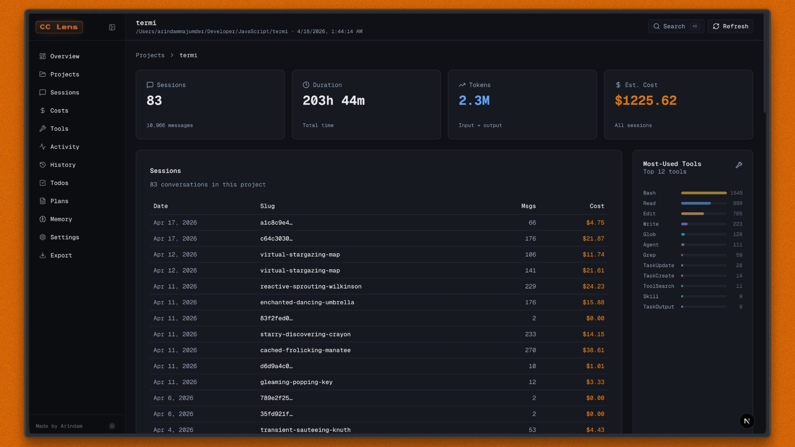

- Searchable, sortable project grid.
- Per-project cards with sessions, duration, estimated cost, languages, git branches, MCP/agent badges, and top tools.
- Project detail pages with sessions, cost over time, language distribution, branch activity, and tool usage.

### Sessions

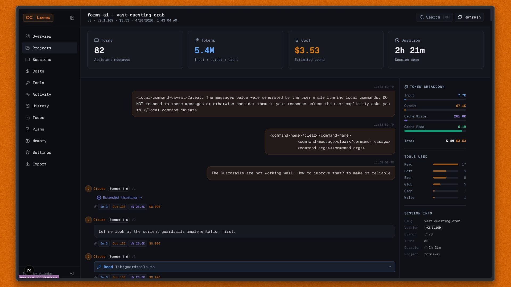

- Searchable session table with badges for compaction, agents, MCP, web search/fetch, and extended thinking.
- Full session replay reconstructed from JSONL.
- Assistant responses rendered as GitHub-flavored Markdown.
- Tool calls and tool results shown inline.
- File read/write/update tool results parsed into readable cards.
- Per-turn model, duration, token breakdown, and estimated cost.
- Compaction events shown in context with a token accumulation chart.

### Raw API Inspector (this fork)

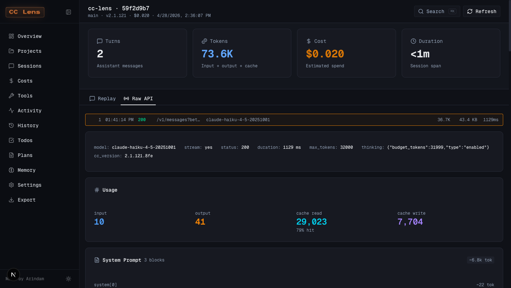

A built-in HTTP proxy intercepts every request Claude Code makes to `api.anthropic.com`,
gzips request and response bodies to disk, and renders them on a new **Live** page (real-time
tail across all sessions) and on each session page under a **Raw API** tab.

Start, stop, and observe the proxy from the dashboard — there's a **Live Capture** button in
the top bar with a green/red indicator and a popover that exposes the connect command with a
copy button.

What you can see for each captured request:

- **Meta strip** — model, stream flag, status, duration, `max_tokens`, `thinking` config
  (including extended-thinking budget), `output_config`, and the `cc_version` parsed from
  the smuggled `x-anthropic-billing-header`.
- **Usage** — input / output / cache-read / cache-write tokens with the cache hit rate.
- **System Prompt** — the literal three-block system prompt Claude Code sends, with
  cyan **cache breakpoint** lines marking exactly where the prompt cache is cut and
  per-block token estimates.
- **Tool Definitions** — collapsible cards for each of the 40+ tools Claude Code exposes,
  with the full JSON schema sent to the model and a token cost per tool.
- **Message History** — color-coded user/assistant turns broken into typed blocks
  (`text`, `thinking`, `tool_use`, `tool_result`) with per-block token estimates and
  cached/final badges.
- **Response** — the raw SSE event stream as it came off the wire.

The proxy is single-user and stateless: it forwards your `Authorization` / `x-api-key`
header untouched, never persists headers to disk, and only stores the JSON request and
response bodies under `~/.cc-lens/payloads/<sessionId>/`. A SQLite index lives at
`~/.cc-lens/inspector.db`.

#### Using it

Run cc-lens as usual:

```bash
npx @theodo-group/cc-lens
# or, until the package is published, run it straight from GitHub:
npx github:theodo-group/cc-lens
```

The dashboard opens in your browser. The proxy is **off by default** — click the
**Live Capture** button in the top bar, hit **Start**, and the popover will display
the connect command on a free port:

```bash
ANTHROPIC_BASE_URL=http://localhost:<port> claude
```

Copy it with the button next to the snippet, paste in a new terminal, and use Claude
Code normally. Captures stream to the **Live** page in real time and to each session's
**Raw API** tab. The proxy persists across Next.js restarts (PID file at
`~/.cc-lens/proxy.json`); click **Stop** to terminate it.

Captures are correlated to JSONL sessions automatically by parsing
`metadata.user_id.session_id` from the request body — the same UUID that names the
JSONL file. Retention defaults to 1 GB total or 30 days, whichever comes first; tune
via `CC_LENS_RETENTION_BYTES` and `CC_LENS_RETENTION_DAYS`.

### Costs

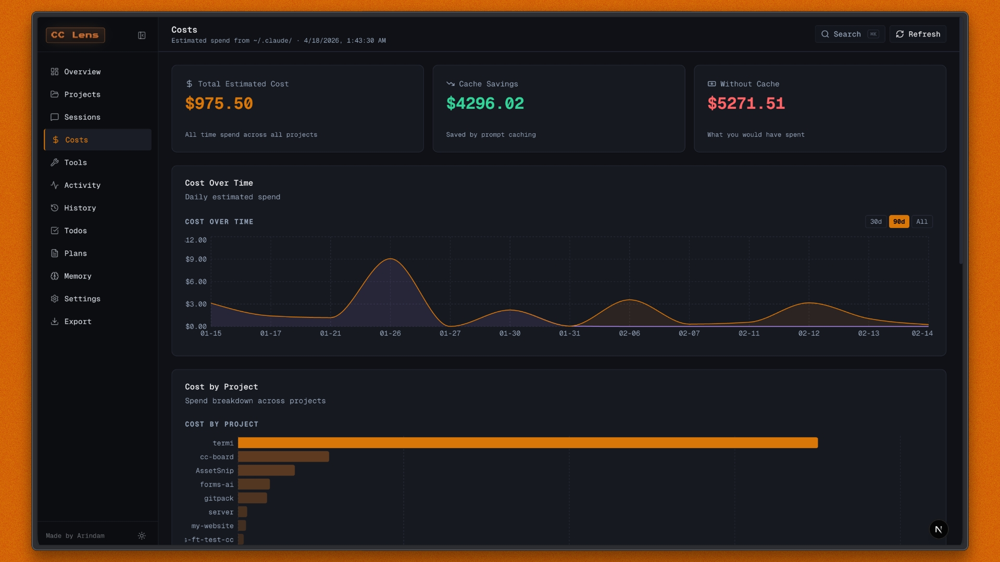

- Total estimated cost, cache savings, and estimated cost without cache.
- Cost over time and cost by project.
- Per-model token and cost breakdown.
- Cache efficiency panel.
- Pricing reference from `lib/pricing.ts`.

### Tools & Features
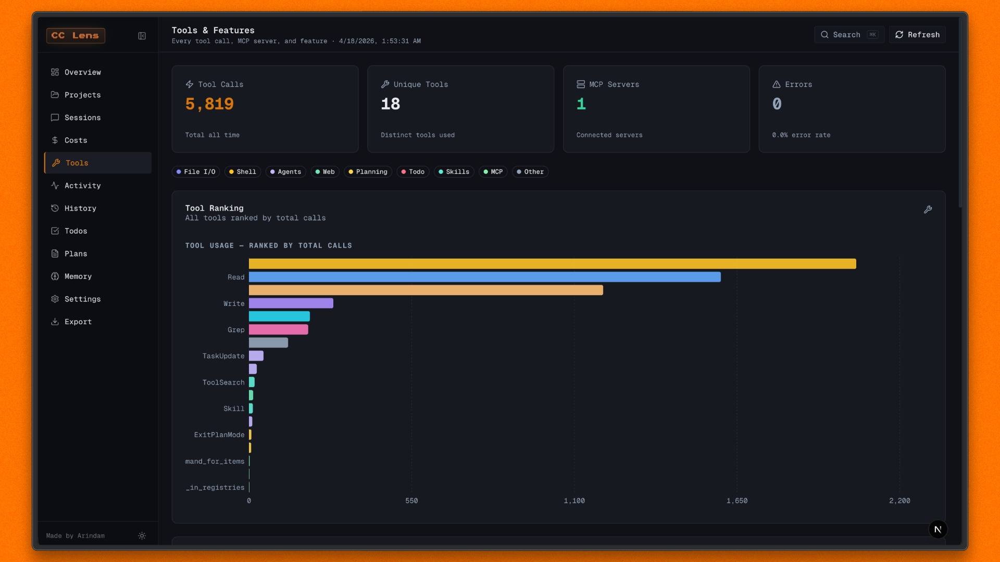

- Tool ranking across all sessions.
- Tool categories for file I/O, shell, agents, web, planning, todos, skills, MCP, and other calls.
- MCP server usage details.
- Feature adoption across sessions.
- Tool error analysis.
- Claude Code version history.
- Git branch analytics.

### Activity

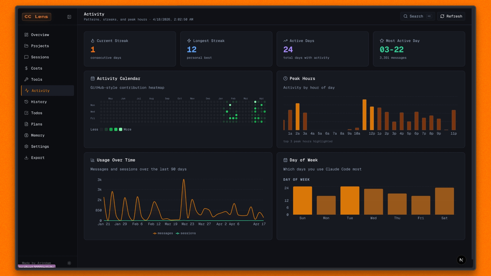

- GitHub-style activity calendar.
- Current streak, longest streak, active days, and most active day.
- Usage over time, peak hours, and day-of-week patterns.
- Activity can be derived from session JSONL when the stats cache is incomplete.

### Local Claude Code Files

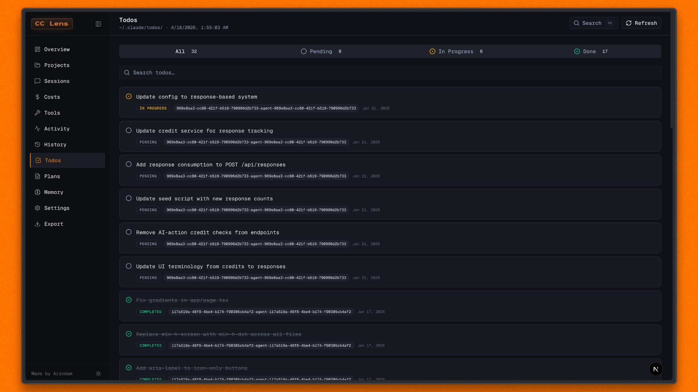

- **History**: Search and page through `~/.claude/history.jsonl`.
- **Todos**: Browse todos from `~/.claude/todos/` with search and status filters.
- **Plans**: Read saved plans from `~/.claude/plans/` with inline Markdown rendering.
- **Memory**: Browse and edit memory files across projects, with type filters and stale detection.
- **Settings**: Inspect `~/.claude/settings.json`, installed skills, plugins, MCP servers, and storage usage.

### Export & Import

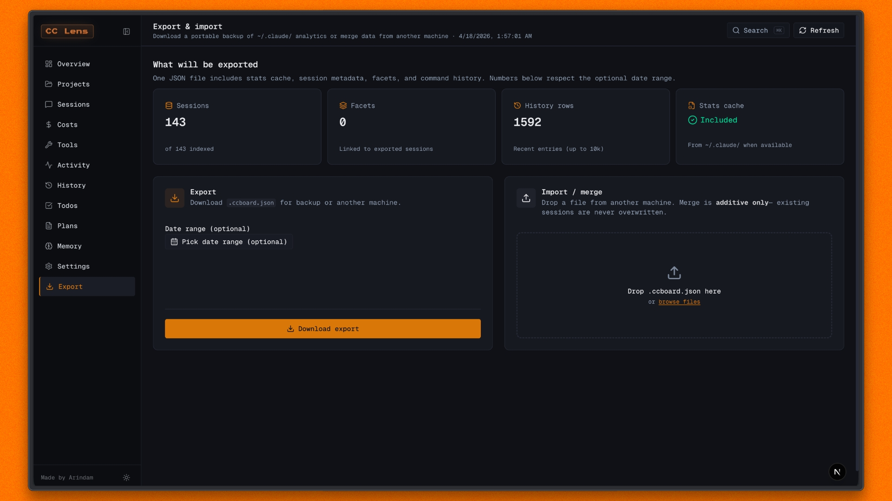

- Export a portable `.ccboard.json` file containing stats, session metadata, facets, and recent command history.
- Preview export counts before downloading.
- Optionally filter exports by session start date.
- Drop an export file to preview an additive merge from another machine.

Import is intentionally preview-only right now. It shows which sessions are new or already present, but it does not write merged data back into `~/.claude/`, to avoid corrupting live Claude Code files.

## Navigation

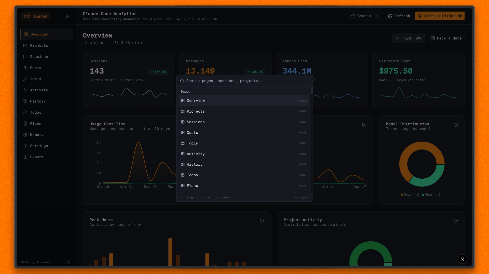

- Global search: `Cmd+K`, `Ctrl+K`, or `/`.
- Session list keyboard navigation: `j` / `k` to move, `Enter` to open, `Esc` to clear.
- Page shortcuts: `g` plus a page key, for example `g s` for sessions, `g p` for projects, `g c` for costs.
- Responsive layout with desktop sidebar, collapsible navigation, mobile bottom nav, and mobile menu.
- Light and dark themes.

## Multiple Claude Profiles

By default, `cc-lens` reads `~/.claude/`. To point it at another Claude Code config directory, set `CLAUDE_CONFIG_DIR`:

```bash
# Default profile
npx cc-lens

# Work profile
CLAUDE_CONFIG_DIR=~/.claude-work npx cc-lens
```

On Windows PowerShell:

```powershell
$env:CLAUDE_CONFIG_DIR="C:\Users\you\.claude-work"; npx cc-lens
```

The active config directory is shown in the CLI banner on launch.

## Run From Source

### Prerequisites

- Node.js 18+
- Claude Code with local data in `~/.claude/`

### Development

```bash
npm install
npm run dev
```

Open [http://localhost:3000](http://localhost:3000), or the port shown in your terminal.

### Production Build

```bash
npm run build
npm start
```

### Lint

```bash
npm run lint
```

## Data Sources

`cc-lens` reads local Claude Code files directly:

- `~/.claude/projects/<slug>/*.jsonl`: session JSONL and replay data
- `~/.claude/stats-cache.json`: aggregate stats when available
- `~/.claude/usage-data/session-meta/`: session metadata fallback
- `~/.claude/history.jsonl`: command history
- `~/.claude/todos/`: todo files
- `~/.claude/plans/`: saved plan files
- `~/.claude/projects/*/memory/`: project memory files
- `~/.claude/settings.json`: settings, skills, plugins, and MCP config

Dashboard data refreshes every 5 seconds while the app is open.

## Privacy

Claude Code Lens runs locally and reads files from your machine. It does not require a login, hosted backend, or telemetry service. Your Claude Code history stays on your computer.

The optional Raw API Inspector proxy is off by default. You launch it from the dashboard
(top-bar **Live Capture** button → **Start**), and it only intercepts traffic when you
explicitly point Claude Code at it via `ANTHROPIC_BASE_URL`. Captured request and
response bodies are written locally to `~/.cc-lens/`. Auth headers are forwarded to
Anthropic but never persisted. Click **Stop** to terminate the proxy.

## Cost Estimates

Claude Code stores token counts and model identifiers, not final billing totals. `cc-lens` estimates cost using the pricing table in `lib/pricing.ts`. If provider pricing changes, update that file to keep estimates current.

## Star History

<a href="https://www.star-history.com/?repos=Arindam200%2Fcc-lens&type=date&legend=top-left">
 <picture>
   <source media="(prefers-color-scheme: dark)" srcset="https://api.star-history.com/chart?repos=Arindam200/cc-lens&type=date&theme=dark&legend=top-left" />
   <source media="(prefers-color-scheme: light)" srcset="https://api.star-history.com/chart?repos=Arindam200/cc-lens&type=date&legend=top-left" />
   
 </picture>
</a>
